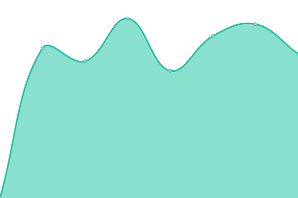
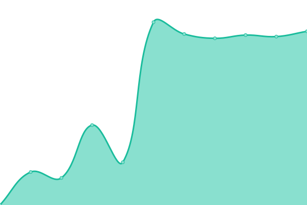
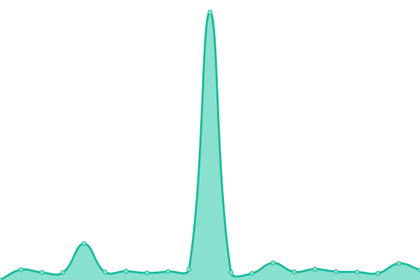
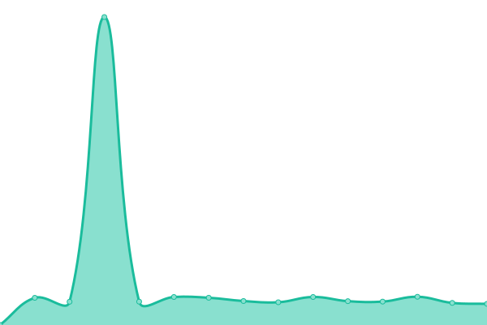
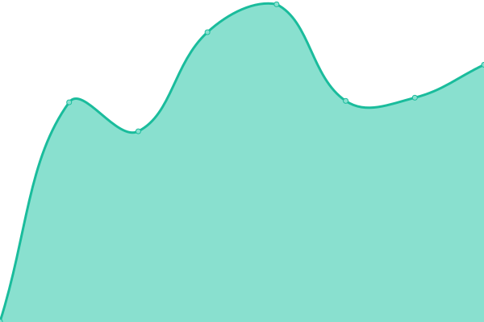
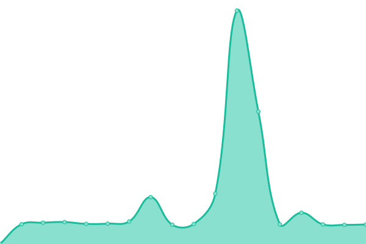
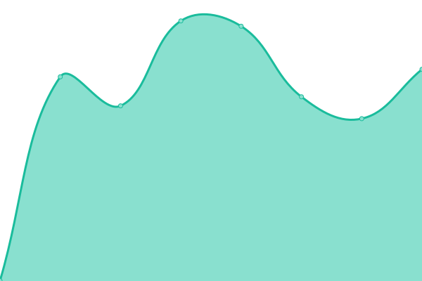

# [📈 Live Status](https://upptime.github.io/upptime): <!--live status--> **🟩 All systems operational**

This repository contains the open-source uptime monitor and status page for [Upptime](https://upptime.js.org), powered by [Upptime](https://github.com/upptime/upptime).

With [Upptime](https://upptime.js.org), you can get your own unlimited and free uptime monitor and status page, powered entirely by a GitHub repository. We use [Issues](https://github.com/upptime/upptime/issues) as incident reports, [Actions](https://github.com/upptime/upptime/actions) as uptime monitors, and [Pages](https://upptime.github.io/upptime) for the status page.

<!--start: status pages-->
<!-- This summary is generated by Upptime (https://github.com/upptime/upptime) -->
<!-- Do not edit this manually, your changes will be overwritten -->
<!-- prettier-ignore -->
| URL | Status | History | Response Time | Uptime |
| --- | ------ | ------- | ------------- | ------ |
|  Mego | 🟩 Up | [mego.yml](https://github.com/Zombie-Action/monitor/commits/HEAD/history/mego.yml) | 

 1016ms
     
 | 

<a href="https://Zombie-Action.github.io/monitor/history/mego">99.58%</a>
    

|  Mego API1 | 🟩 Up | [mego-api-1.yml](https://github.com/Zombie-Action/monitor/commits/HEAD/history/mego-api-1.yml) | 

 689ms
     
 | 

<a href="https://Zombie-Action.github.io/monitor/history/mego-api-1">99.53%</a>
    

|  Mego API2 | 🟩 Up | [mego-api-2.yml](https://github.com/Zombie-Action/monitor/commits/HEAD/history/mego-api-2.yml) | 

 649ms
     
 | 

<a href="https://Zombie-Action.github.io/monitor/history/mego-api-2">99.31%</a>
    

|  Mego API3 | 🟩 Up | [mego-api-3.yml](https://github.com/Zombie-Action/monitor/commits/HEAD/history/mego-api-3.yml) | 

 659ms
     
 | 

<a href="https://Zombie-Action.github.io/monitor/history/mego-api-3">99.60%</a>
    

|  Mego API4 | 🟩 Up | [mego-api-4.yml](https://github.com/Zombie-Action/monitor/commits/HEAD/history/mego-api-4.yml) | 

 1056ms
     
 | 

<a href="https://Zombie-Action.github.io/monitor/history/mego-api-4">99.46%</a>
    

|  Mego API5 | 🟩 Up | [mego-api-5.yml](https://github.com/Zombie-Action/monitor/commits/HEAD/history/mego-api-5.yml) | 

 674ms
     
 | 

<a href="https://Zombie-Action.github.io/monitor/history/mego-api-5">99.45%</a>
    

|  Zabbix | 🟩 Up | [zabbix.yml](https://github.com/Zombie-Action/monitor/commits/HEAD/history/zabbix.yml) | 

 699ms
     
 | 

<a href="https://Zombie-Action.github.io/monitor/history/zabbix">100.00%</a>
    

<!--end: status pages-->

[**Visit our status website →**](https://upptime.github.io/upptime)

## 📄 License

- Powered by: [Upptime](https://github.com/upptime/upptime)
- Code: [MIT](./LICENSE) © [Upptime](https://upptime.js.org)
- Data in the `./history` directory: [Open Database License](https://opendatacommons.org/licenses/odbl/1-0/)
